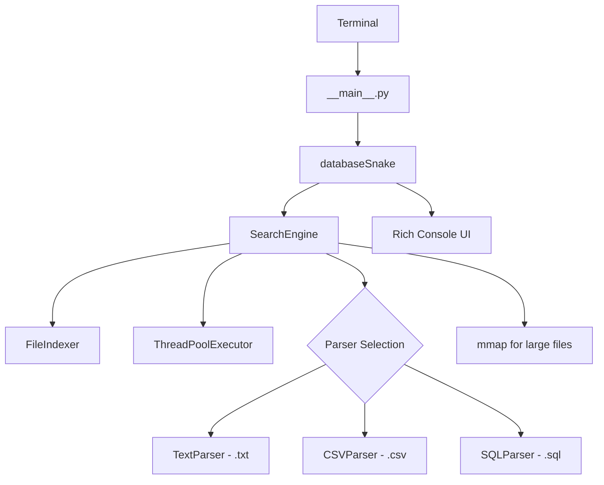

<p align="center">
  
</p>

<p align="center">
  
</p>

<p align="center">
  <a href="https://github.com/xsyncio/databaseSnake/stargazers"></a>
  <a href="https://github.com/xsyncio/databaseSnake/issues"></a>
  <a href="https://github.com/xsyncio/databaseSnake/blob/main/LICENSE"></a>
  <a href="https://www.python.org/"></a>
</p>

<p align="center">
  <a href="https://github.com/xsyncio"></a>
  
  
</p>

---

<div align="center">

```
   ▄▄                  ▄▄                       ▄▄▄▄▄▄▄                          
   ██        ██        ██                      █████▀▀▀             ▄▄           
▄████  ▀▀█▄ ▀██▀▀ ▀▀█▄ ████▄  ▀▀█▄ ▄█▀▀▀ ▄█▀█▄  ▀████▄  ████▄  ▀▀█▄ ██ ▄█▀ ▄█▀█▄ 
██ ██ ▄█▀██  ██  ▄█▀██ ██ ██ ▄█▀██ ▀███▄ ██▄█▀    ▀████ ██ ██ ▄█▀██ ████   ██▄█▀ 
▀████ ▀█▄██  ██  ▀█▄██ ████▀ ▀█▄██ ▄▄▄█▀ ▀█▄▄▄ ███████▀ ██ ██ ▀█▄██ ██ ▀█▄ ▀█▄▄▄ 
```

</div>

---

## 🚀 Features

<table>
<tr>
<td width="50%">

### ⚡ **Blazing Fast**
- **Memory-mapped I/O** for files >10MB
- **Parallel search** with ThreadPoolExecutor  
- **LRU caching** for repeated queries
- Optimized `casefold()` for case-insensitive search

</td>
<td width="50%">

### 🔒 **Type Perfect**
- **basedpyright** at strictest settings
- **Zero errors**, zero warnings
- Full type annotations everywhere
- No `# type: ignore` anywhere

</td>
</tr>
<tr>
<td width="50%">

### 📁 **Multi-Format Support**
- CSV files (comma-separated)
- TXT files (line-by-line)
- SQL files (data dumps)
- Automatic parser selection

</td>
<td width="50%">

### 🎨 **Beautiful Console**
- Rich console output with colors
- Progress animations
- Styled search results
- TTY-safe color detection

</td>
</tr>
</table>

---

## 📦 Installation

```bash
# Clone the repository
git clone https://github.com/xsyncio/databaseSnake.git
cd databaseSnake

# Create virtual environment
python -m venv .venv
source .venv/bin/activate  # Linux/Mac
# .venv\Scripts\activate   # Windows

# Install dependencies
pip install -r requirements.txt
# Or install as package
pip install -e .
```

---

## 🐍 Quick Start

```bash
# Run the application
python main.py

# Or run as module
python -m dbsearcher
```

<details>
<summary>📸 <strong>Screenshot Preview</strong></summary>

```
╭────────────────────────────────────────────────────────────────────────────╮
│    ▄▄                  ▄▄                       ▄▄▄▄▄▄▄                    │
│    ██        ██        ██                      █████▀▀▀             ▄▄     │
│ ▄████  ▀▀█▄ ▀██▀▀ ▀▀█▄ ████▄  ▀▀█▄ ▄█▀▀▀ ▄█▀█▄  ▀████▄  ████▄  ▀▀█▄ ██ ▄█▀ │
│ ██ ██ ▄█▀██  ██  ▄█▀██ ██ ██ ▄█▀██ ▀███▄ ██▄█▀    ▀████ ██ ██ ▄█▀██ ████  │
│ ▀████ ▀█▄██  ██  ▀█▄██ ████▀ ▀█▄██ ▄▄▄█▀ ▀█▄▄▄ ███████▀ ██ ██ ▀█▄██ ██ ▀█▄│
╰────────────────────────────────────────────────────────────────────────────╯
╭──────────────────────────────────────────────────────╮
│ v1.0.0 | by Xsyncio | https://github.com/xsyncio     │
╰──────────────────────────────────────────────────────╯

📁 Files: 18 | 💾 Size: 9718.45 MB

🔍 Search Examples:
• User ID: 556343434
• Phone: +19000000000
• Name: John
• Email: example@mail.eg

1. Search in databases
2. Exit

Choose an option: _
```

</details>

---

## 🏗️ Architecture



---

## 📁 Project Structure

```
databaseSnake/
├── 📄 main.py                 # Entry point
├── 📄 pyproject.toml          # Project config
├── 📂 base/                   # Your database files go here
│   ├── data.csv
│   ├── users.txt
│   └── dump.sql
└── 📂 dbsearcher/             # Main package
    ├── 📄 __init__.py         # Package init
    ├── 📄 __main__.py         # CLI entry
    ├── 📄 constants.py        # Configuration
    ├── 📄 exceptions.py       # Custom errors
    ├── 📄 logging.py          # Rich logging
    ├── 📄 types.py            # Type definitions
    ├── 📂 search/             # Search engine
    │   ├── engine.py          # Main coordinator
    │   ├── indexer.py         # File indexer
    │   ├── parsers.py         # Format parsers
    │   └── results.py         # Result formatting
    ├── 📂 ui/                  # Console UI
    │   ├── colors.py          # ANSI colors
    │   ├── display.py         # Display utils
    │   ├── effects.py         # Animations
    │   └── menu.py            # Menu system
    └── 📂 utils/              # Utilities
        ├── external.py        # URL opening
        ├── filesystem.py      # File operations
        └── platform.py        # Platform detection
```

---

## ⚙️ Performance Optimizations

| Technique | Description | Benefit |
|-----------|-------------|---------|
| 🗺️ **mmap** | Memory-mapped file I/O | Zero-copy reads for >10MB files |
| 🧵 **ThreadPool** | Parallel file processing | N× speedup on multi-core |
| 📦 **LRU Cache** | Result caching | Instant repeated queries |
| 🔤 **casefold()** | Optimized case folding | Faster than `.lower()` |
| ⏱️ **Early Exit** | Max results limit | Stops at first N matches |
| 🔄 **Generators** | Streaming iteration | Zero full-list allocation |

---

## 🛠️ Configuration

Edit `dbsearcher/constants.py` to customize:

```python
# Performance tuning
MMAP_THRESHOLD_BYTES = 10 * 1024 * 1024  # Use mmap for files > 10MB
DEFAULT_PARALLEL_WORKERS = 4             # Number of parallel workers
MAX_RESULTS_DEFAULT = 10000              # Maximum results to return

# Supported file types
SUPPORTED_EXTENSIONS = (".csv", ".txt", ".sql")
```

---

## 🧪 Type Checking

This project uses **basedpyright** at the strictest settings possible:

```bash
# Install basedpyright
pip install basedpyright

# Run type checker
basedpyright dbsearcher/

# Expected output:
# 0 errors, 0 warnings, 0 notes ✅
```

---

## 📜 License

This project is licensed under the **MIT License** - see the [LICENSE](LICENSE) file for details.

---

## 🙏 Credits

<p align="center">
  <a href="https://github.com/xsyncio">
    
  </a>
</p>

<p align="center">
  <sub>Built with 🐍 Python and ❤️ by <a href="https://github.com/xsyncio">Xsyncio</a></sub>
</p>

---

<p align="center">
  
</p>
